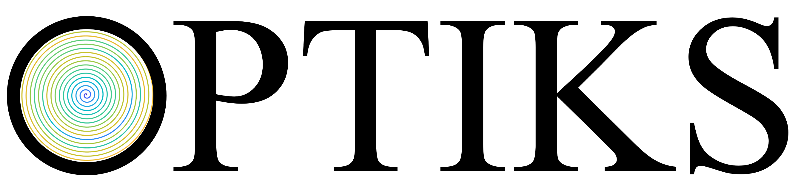
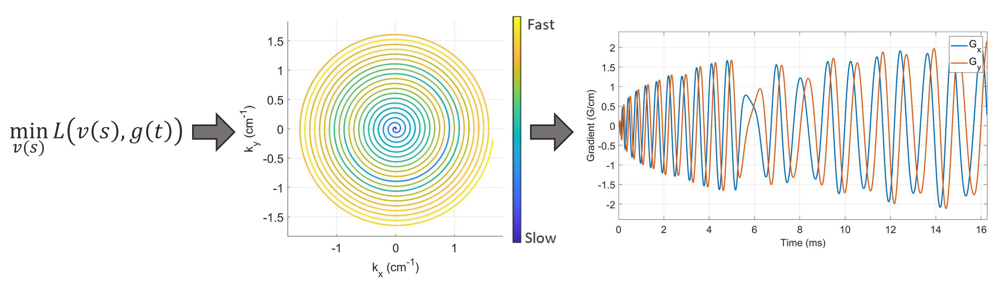
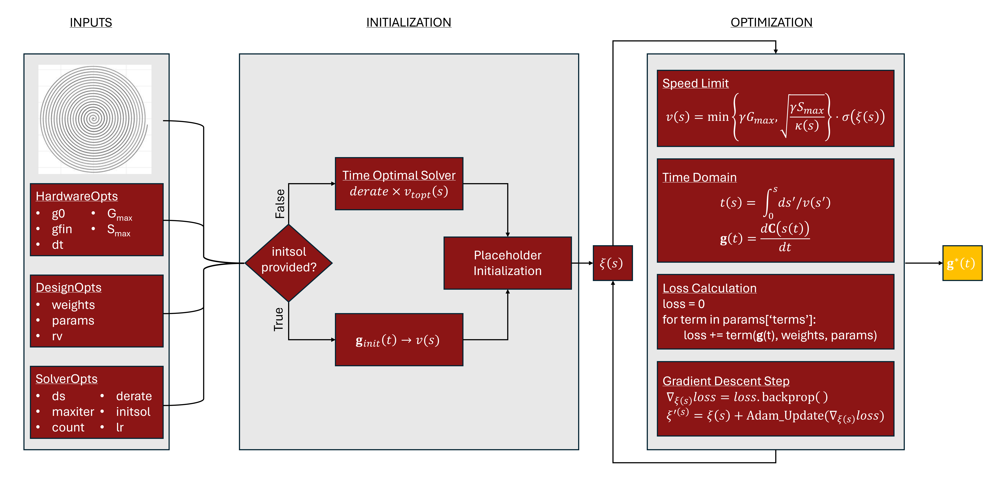
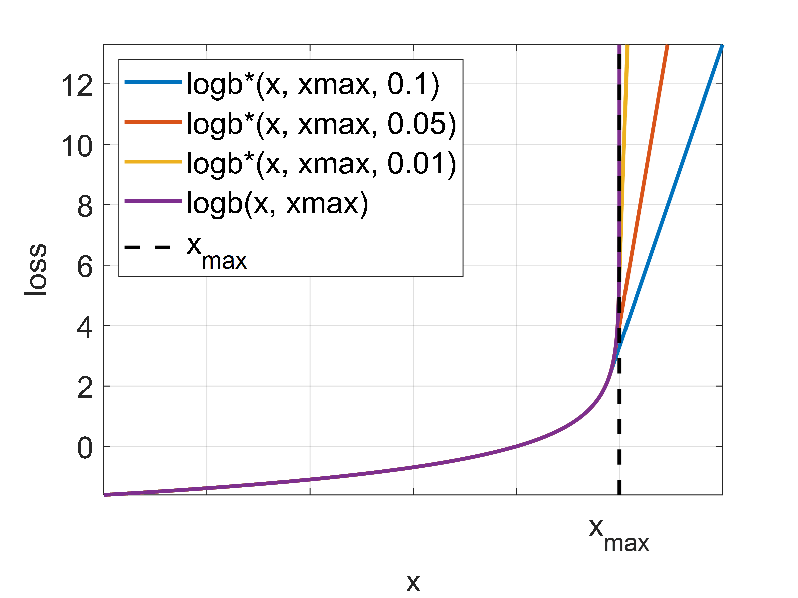

# OPTIKS

Optimizied (gradient) Properties through Timing In K-Space.
Please cite [TBD] when using this package.

This package is intended for the design of arbitrary k-space trajectory gradient waveforms in MRI, optimized to a custom
loss function specified by the user. Implemented loss function terms include: time minimization, time bounding, 
mechanical resonance minimization, PNS limitation, and acoustic noise minimization. The user may define and optimize
their own loss function terms in any combination with existing ones.



## Installation / Setup

From the command line clone the optiks repo:
```
git clone https://github.com/mattmc-stanford/optiks.git
```

Then install optiks as a package. If you wish to just use optiks and not perform any customization run the command:
```
pip install .
```

If instead you wish to create custom loss functions or otherwise edit optiks and use the edited package run the command:
```
pip install -e .
```

## Organization

The package modules are split into 4 groups; options, loss_functions, utils, and optiks.

_**optiks.options**_: includes @dataclass types for organizing inputs to the design code<br />
_**optiks.loss_functions**_: includes implemented loss function terms<br />
_**optiks.utils**_: includes additional useful functions (spiral/rosette design, torch tensor 1d interp, gpu selection)<br />
_**optiks.optiks**_: inludes functions for designing gradient waveform. Users should only need function _optiks_.



## Example Scripts

Examples can be found under:
https://github.com/mattmc-stanford/optiks/tree/main/tests

Getting started:
```
from optiks.optiks import optiks
from optiks.options import *
from optiks.loss_functions import *
from optiks.utils import spiralTraj  # optional
```

## Debugging

#### Runaway Time Waveforms:
Occasionally the solver tries to design waveforms with a great deal of dead-time where effectively nothing is happening.
Despite the time minimization term it can find this advantageous. If you are struggling with this issue try switching to
the bound time loss term. Hopefully this bug will be fixed in the future.


#### Bound Time Loss Term:
If the duration of the waveform at any point during gradient descent exceeds the upper bound set by the user, the
log-barrier function will evaluate to infinity and gradient descent will likely fail to recover.

This can be avoided by; **a)** ensuring the initial solution (derate * time optimal, or custom initial solution) is
shorter than the upper bound, **b)** Using a smaller learning rate, **c)** using a larger weight on the bound time term,
or **d)** using a higher slew-rate together with a pns-limiting term to design a faster waveform.

#### Slew-Rate and PNS Violations:
If you are struggling with slew-rate or PNS threshold being violated there are a few steps that can be taken; **a)**
Lowering the learning rate, **b)** finer arc-length domain sampling (ds), **c)** adjusting weights or allowing more time
if bound time is being used, or **d)** adjusting the delta parameters of the leaky log-barrier functions - smaller
deltas leads to stronger enforcement.

#### The "Leaky" Log-Barrier:
For time-domain constraints such as slew-rate and PNS limits gradient descent in the arc-length domain can easily 
violate log-barriers in the time-domain. To relax these constraints we introduce the "leaky" log-barrier function which
becomes linear after some point x<sub>max</sub> - &delta;.



## References
_Paper coming soon_

ISMRM Abstract (Under Review):

[1] _Optimized gradient Properties through Timing In K-Space (OPTIKS), M. A. McCready, X. Cao, C. Liao, K. Setsompop, J. M. Pauly, and A. B. Kerr. Proc. Intl. Soc. Mag. Res. Med., 2025_

Background Literature:

[2] M. Lustig, S.-J. Kim, and J. M. Pauly, “A fast method for designing time-optimal gradient waveforms for arbitrary k-space trajectories,” IEEE
Transactions on Medical Imaging, vol. 27, no. 6, pp. 866–873, 2008.

[3] The Fastest Arbitrary k-space Trajectories, S. Vaziri and M. Lustig. Abstract No 2284. Proc. Intl. Soc. Mag. Res. Med. 20, 2012
https://people.eecs.berkeley.edu/~mlustig/tOptGrad_ISMRM12.pdf

[4] SAFE-Model - A New Method for Predicting Peripheral Nerve Stimulations in MRI, F.X. Herbank and M. Gebhardt. Abstract No 2007. Proc. Intl. Soc. Mag. Res. Med. 8, 2000, Denver, Colorado, USA
https://cds.ismrm.org/ismrm-2000/PDF7/2007.PDF

[5] “Medical electrical equipment - part 2–33: particular requirements for the basic safety and essential performance of magnetic resonance equipment
for medical diagnosis,” standard, International Electrotechnical Commission, Aug. 2022.

[6] PulseSeq https://github.com/pulseq/pulseq